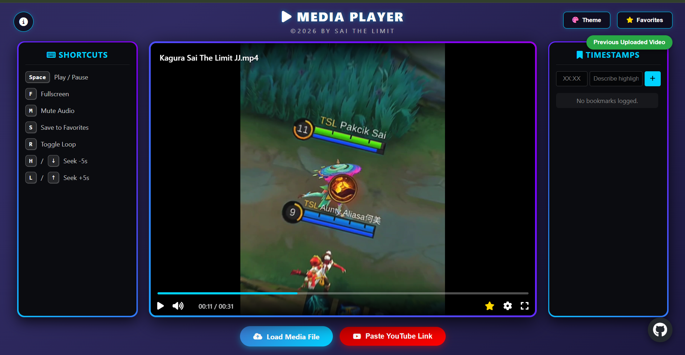

# 🎬 Advanced Media Player

An interactive, responsive, and high-performance web-based media application designed for seamless local playback and dynamic streaming. Built with clean semantic HTML5, modern CSS layouts, and pure JavaScript.

---

## 🚀 Key Features

*   📁 **Secure Local Playback:** Drag and drop or upload local video files directly within your browser safely—no server uploads required.
*   🔗 **YouTube Embedded Mode:** Toggle effortlessly between native local files and integrated YouTube video links.
*   🎨 **Dynamic Theme Grid:** Switch between 7 beautifully crafted custom accent colors (Ruby Red, Bronze, Gold, Emerald, Diamond, Amethyst, and the default Blue Sapphire) on the fly.
*   🔖 **Smart Timestamp Bookmarking:** Log custom annotations or highlight specific frames with an intuitive IndexedDB-backed bookmark list.
*   ⭐ **Persistent Favorites System:** Save your preferred local tracks into a robust collection, featuring active marquee title scrolling and ascending/descending sorting options (by Name, Size, or Date Added).
*   🔄 **Dual-Session File Swapping:** Instantly switch between your current video and the previously uploaded video session with a single click.

---

## ⌨️ Global Keyboard Shortcuts

Control your media experience lightning-fast without ever touching the mouse:

| Key | Action Performed |
| :--- | :--- |
| <kbd>Space</kbd> | Play / Pause Media |
| <kbd>F</kbd> | Toggle Fullscreen Mode |
| <kbd>M</kbd> | Toggle Audio Mute |
| <kbd>S</kbd> | Save Current Video to Favorites |
| <kbd>R</kbd> | Toggle Video Loop (On / Off) |
| <kbd>H</kbd> / <kbd>←</kbd> / <kbd>↓</kbd> | Rewind / Seek backward 5 seconds |
| <kbd>L</kbd> / <kbd>→</kbd> / <kbd>↑</kbd> | Fast Forward / Seek forward 5 seconds |

---

## 🛠️ Architecture & Tech Stack

*   **Frontend UI:** Vanilla JavaScript, Modern CSS Variables (Custom Themes), FontAwesome 6.4.0 Icons.
*   **Storage APIs:** **IndexedDB** for fast, high-capacity client-side structural storage of bookmarks, timestamp arrays, and favorite asset metadata.
*   **Media APIs:** HTML5 Native `HTMLVideoElement` interfaces, custom progress calculation modules, and programmatic URL Object lifecycle allocation.

---

## 📦 Local Deployment

To run this application locally, you don't need to configure a server environment:

1. Clone or download this project repository.
2. Ensure your workspace includes the application script file (`VideoPlayer.html`), your assets (like `Saiffuddin.png`), and any icon configuration files.
3. Open `VideoPlayer.html` directly in any modern, compliant web browser (Chrome, Edge, Firefox, or Safari).

---

### 👨‍💻 Developer Identity & Credits

**Advanced Media Player** is developed, maintained, and engineered by:

### **Muhammad Saiffuddin Bin Ahmad Fauzi**
*(Sai the Limited)*

**© 2026 BY SAI THE LIMIT. ALL RIGHTS RESERVED.**

